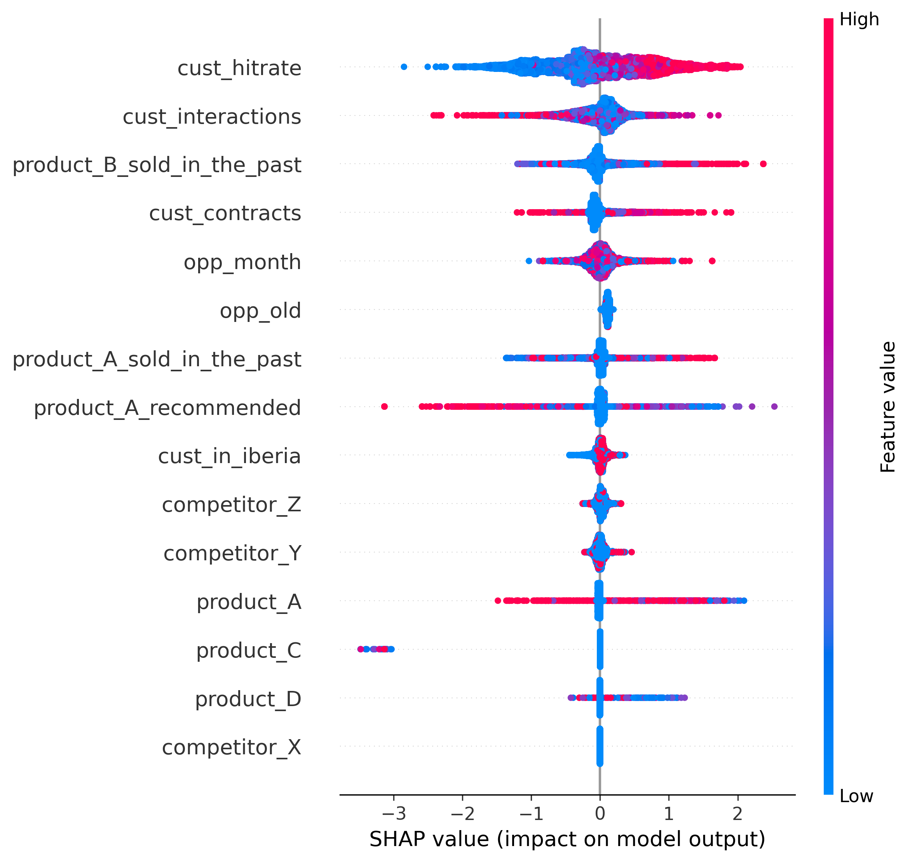
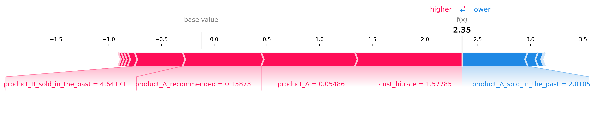

# ML MODEL - Schneider Electric

## Problema
-----------

Tenim un dataset amb valors que aporten informació sobre el resultat d'una oportunitat de negoci. Aquesta oportunitat només pot tenir dos resultats possibles: guanyada o perduda; el nostre objectiu és predir aquest output.

## Plantejament de solució
--------------------------

Per predir el producte de cada oportunitat, un model de Machine Learning és el més adient i, tenint en compte que el valor que volem conèixer és binari categòric (ja que només té dues possibilitats), el tipus de ML que hem desenvolupat ha sigut un de Regressió logística. Tot i així, no únicament, ja que l'hem fusionat (hem fet stacking) amb un altre tipus: XGBoost.

## Fusió entre XGBoost i Regressió logística
--------------------------------------------

**XGBoost:** (eXtreme Gradient Boosting) és una biblioteca de machine learning distribuïda i de codi obert dissenyada per ser altament eficient, que resol molts problemes de ciència de dades de manera ràpida i precisa. Utilitza un algoritme de boosting basat en arbres de decisió potenciats pel gradient (els quals intenten corregir els errors de l'arbre anterior), que fa ús del descens pel gradient.

**Regressió logística:** és un model estadístic que té com a finalitat predir la possibilitat que succeeixi un event amb dos resultats possibles (binari) utilitzant una variable dependent binària i una o més variables independents. Aquest model utilitza la funció sigmoide per transformar la combinació lineal de les variables independents d'entrada en un valor entre 0 i 1, donant com a resultat una corba en forma d'S que representa la probabilitat.

## Explicació estesa del programa:
----------------------------------

El nostre programa entrena un model de classificació amb Stacking (combinació de XGBoost + regressió logística) i incorpora eines d’explicabilitat com SHAP i LIME per entendre les prediccions. Finalment, permet fer prediccions sobre un nou fitxer CSV proporcionat per l’usuari.

Primer, llegim les dades proporcionades per un conjunt de dades i separem les característiques (X) de la variable objectiu (y). Un cop llegides les dades, fem una divisió del model de classificació on un 80% consta de l'entrenament i un 20% del test. Cal destacar que les dades són normalitzades per tal de poder treballar amb variables de la mateixa magnitud.

El model entrenat utilitza XGBoost com a model base i regressió logística com a model final. XGBoost analitza la importància de cada variable i imprimeix les dades ordenades descendentment segons rellevància.

La regressió logística actua com a meta‑model dins del Stacking. Combina les prediccions del model base, XGBoost, i les transforma en una classificació binària. A l'hora de calcular la probabilitat, s'assigna a 1 si és superior a 0.5, i a 0 en cas contrari.
Un cop entrenat el model amb les dades escalades, es fan prediccions sobre el conjunt de test i es mostra un informe de classificació. Aquest informe permet avaluar el rendiment del model i mostra mètriques com la proporció de prediccions correctes sobre les positives (precisió), la proporció de positius detectats correctament (exhaustivitat), la mitjana harmònica entre precisió i exhaustivitat (F1‑score), i el nombre de mostres de cada classe (support).

**SHAP:** Calcula la contribució de cada característica a la predicció d'un model i ajuda a entendre per què un model ha pres una decisió. En el nostre programa, s'utilitza per veure quines variables són més rellevants en general i, en l'àmbit local, per analitzar un cas concret.

**LIME:** Explica la predicció del primer cas de test generant una explicació local en HTML, que mostra quines variables han influït més en la decisió del model per aquella instància.

Finalment, es demana a l'usuari un nou fitxer CSV i, escalant les dades, es fan prediccions amb el model entrenat.

Com a resultats, obtindrem un informe de classificació sobre el model, una anàlisi de la importància de les variables segons XGBoost, un gràfic SHAP, una explicació LIME, i un fitxer CSV amb les prediccions i probabilitats.

## Global insights aplicant SHAP:
---------------------------------

Els paràmetres que tenen més pes / influència en l'output final de target_variable (per ordre) són els següents:

- **Els relacionats amb el comportament històric del client:** Paràmetres com cust_hitrate o product_A_sold_in_the_past són el factor més rellevant en el guany d'una oportunitat. (Bon passat d'oportunitat -> bon futur d'oportunitat)

- **Els imports dels productes oferts:** product_A, product_C, product_D

- **La presència de competidors:** competitor_X, competitor_Y, competitor_Z usualment redueix la probabilitat de guany

- **Aspectes temporals:** opp_month, opp_old condicionen lleugerament a target_variable. Per exemple: mesos sense alta demanda o oportunitats antigues tendeixen a perdre's.

## Local insights aplicant LIME:
--------------------------------

Agafant un dels casos del conjunt de dades (id = 35214) hem determinat mitjançant LIME que el nostre model ha especificat un 94% de predicció en resultat 1 (oportunitat guanyada) per les següents raons:

Els factors que impulsen cap a 1 tenen uns valors...
• cust_hitrate molt alt. 
• product_A_sold_in_the_past elevat.
• Valor de product_C alineat amb oportunitats guanyades.
Factors que impulsen cap a lost (menor impacte):
• Presència de competitor_X.
• cust_contracts baix.
• Alguns efectes menors de product_D i opp_month.

En resum: Els factors positius superen clarament els negatius, portant a una predicció d'oportunitat guanyada.

| id      | product_A_sold_in_the_past | product_B_sold_in_the_past | product_A_recommended | product_A | product_C | product_D | cust_hitrate | cust_interactions | cust_contracts | opp_month | opp_old | competitor_Z | competitor_X | competitor_Y | cust_in_iberia | target_variable |
|---------|----------------------------|----------------------------|-----------------------|-----------|-----------|-----------|--------------|-------------------|----------------|-----------|---------|---------------|--------------|--------------|----------------|-----------------|
| 35214.0 | 2.01050                    | 4.64171                    | 0.15873               | 0.05486   | -0.02372  | -0.04247  | 1.57785      | -0.68170          | -0.34997       | -0.52841  | -0.28185 | 1             | 0            | 0            | 0              | 1               |
